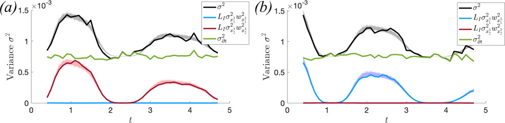
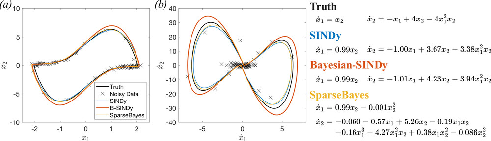
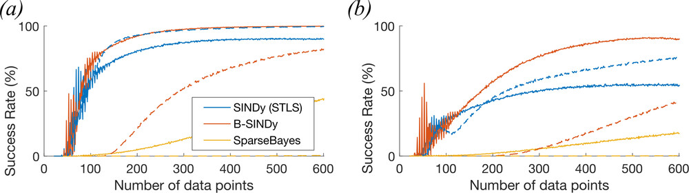
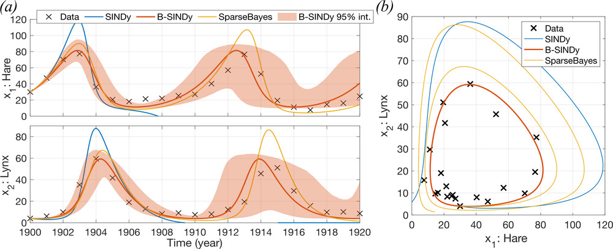

## Summary

```{python}
#| label: comp-imports
import numpy as np
from numpy import typing as npt
from scipy import integrate, optimize
from matplotlib import pyplot as plt

import pysindy
from bsindy_slides import van_der_pol

rng = np.random.default_rng(20250911)
```

Source paper: @fung_rapid_2025

- SINDy is a method used to estimate dynamic models from data
- (Vanilla) SINDy struggles when the data is noisy or scarce
- This paper presents a (fast) Bayesian reformulation of the method under Gaussian noise assumptions
- The Bayesian method is shown to be more robust against noise and data scarcity
- [There are freaks out there that still use MatLab]{.faded-grey}

## Background

A typical problem we have is that we observed some data $y$ from some system, and want to understand how it may behave in the future. I believe this is called _forecasting_.

Often, we will postulate a model $\mathcal{M}$ of how this data behaves in time, subject to some parameters $\theta$ and noise $\epsilon$

$$y = \mathcal{M}(t; \theta) + \epsilon$$

## Background

Often, we also want to _control_ how the system behaves.

- Can we make sure a chemical reactor does not explode?
- Can we program an autonomous robot to stay on course even after being pushed?
- Can we eliminate an infectious disease through targeted intervention?
- Can we drive an economic system to a desired outcome? [@brayton_optimal-control_2014]

To do this, we usually need a good idea of the _mechanisms_ that underly the system.

## Background

**Dynamic Models**

In applied maths, a popular way to write down a mechanistic model $\mathcal{M}$ is by modelling how the state of the system $x$ changes over time:

$$\begin{gathered}
y(t) = x(t) + \epsilon\\
\frac{d}{dt} x(t) = f(t, x; \theta)
\end{gathered}
$$

. . . 

This can be viewed as a "smooth", and nonlinear, version of an autoregressive model (after numerical discretisation):

$$x_{t+\partial{t}} = x_t + f(t, x, \theta) \times \partial t$$


## Background

Usually, we use **domain knowledge** and **blind belief** to _specify_ $f$. For example, we might be observing a simple physical system, like a bouncing spring, where we have a good idea of the _governing equations_.

However, we sometimes have **complex systems** where we do not know exactly how the system behaves (or should behave).
Instead, we are interested in _discovering_ the governing equations from observations.

## SINDy

@brunton_discovering_2016 introduces a method for estimating a model $f$ from data $y$ under a _non-Bayesian_ control engineering framework.

. . .

The idea is that the mechanisms in $f$ can be represented as a **linear combination of simple functions**.

<!-- To select the appropriate terms, **sparsity** is promoted using **S**equentially **T**hresholded **L**east **S**quares (STLS).  -->

$$\begin{aligned}
\frac{d}{dt}{x} = f(x) \approx&\; w_0 + w_1 x + w_2 x^2 + w_3 x^3 + \dots \\
& + w_j sin(x) + w_{j+1} cos(x) + \dots
\end{aligned}
$$

## SINDy

Succinctly, we can write this as

$$\frac{d}{dt} x(t) = w \mathbf{D}$$

where $\mathbf{D}$ is a library of functions of $x(t)$.

. . .

Assume we can map the data $y$ to time deriviatives of state $\frac{d}{dt}x$ via some (linear) operator $L_{\partial t}$

This then can be written down as a linear regression problem

$$L_{\partial t} y = w\mathbf{D} + e$$

## A Running Example

The Van der Pol Oscillator

$$\begin{aligned}
\dot{x}_1 &= x_2\\
\dot{x}_2 &= -x_1 + 4x_2 - 4x_1^2x_2
\end{aligned}
$$


## A Running Example

```{python}
plottable = van_der_pol.generate_solution()

fig, axs = plt.subplots(ncols=2)
axz = axs.flatten()
axz[0].plot(plottable.t, plottable.y.T)
axz[0].set_xlabel('t')
axz[0].legend(['$x_1$', '$x_2$'])

axz[1].plot(*plottable.y, color='k')
axz[1].set_xlabel('$x_1$')
axz[1].set_ylabel('$x_2$')

fig.set_layout_engine('tight')
_ = None
```

## A Running Example

We can view the (equations of the) Van der Pol oscillator as a linear combination of some library functions


$$
\begin{bmatrix} \dot{x}_1 \\ \dot{x}_2 \end{bmatrix} = 
\underbrace{\begin{bmatrix}
0 & 1 & 0 & 0 & 0 & \dots\\
-1 & 4 & 0 & -4 & 0 & \dots
\end{bmatrix}}_{\text{library coefficients~$w$}}
\underbrace{\begin{bmatrix}
x_1 \\ x_2 \\ x_1x_2 \\ x_1^2x_2 \\ x_1x_2^2 \\ \vdots
\end{bmatrix}}_{\text{library of terms~$D$}}
$$

## A Running Example: Vanilla SINDy

The method from @brunton_discovering_2016 is implemented in Python by the `pysindy` library:

```{python}
state_sol = van_der_pol.generate_solution(span_density=van_der_pol.KINDA_DENSE)
observations = van_der_pol.add_noise(state_sol.y, rng=rng)

model_options = dict(
    feature_names=['x1', 'x2'],
    optimizer=pysindy.STLSQ(threshold=0.45),
    feature_library=pysindy.PolynomialLibrary(degree=3),
)

time = state_sol.t
data = observations.T
```

```{python}
#| echo: true

# time = ...
# data = ... + noise

# initialise w/ (hidden) custom options
model = pysindy.SINDy(**model_options) 

model.fit(data, t=time)

model.print()
```

Truth:

$$\begin{aligned}
\dot{x}_1 &= x_2\\
\dot{x}_2 &= -x_1 + 4x_2 - 4x_1^2x_2
\end{aligned}
$$

## A Running Example: Vanilla SINDy

```{python}

model_sol = model.simulate(
    x0=observations[:,0], 
    t=plottable.t
)

fig, axs = plt.subplots(ncols=2)
axz = axs.flatten()
axz[0].plot(state_sol.t, observations.T, 'x')
axz[0].set_prop_cycle(None) 
axz[0].plot(plottable.t, model_sol)

axz[1].plot(*observations, 'x', color='r')
axz[1].plot(*model_sol.T, color='k')
```

## Emerging Problems 


If we try again with less data:

## Emerging Problems
```{python}
sparse_model, sparse_data = van_der_pol.main(
    sparsity=van_der_pol.SPARSE,
    rng=rng,
)

sparse_model.print()
```

```{python}
sparse_model_sol = sparse_model.simulate(
    x0=sparse_data['observations'][:,0], 
    t=plottable.t
)

fig, axs = plt.subplots(ncols=2)
axz = axs.flatten()
axz[0].plot(sparse_data['truth'].t, sparse_data['observations'].T, 'x')
axz[0].set_prop_cycle(None) 
axz[0].plot(plottable.t, sparse_model_sol)

axz[1].plot(*sparse_data['observations'], 'x', color='r')
axz[1].plot(*sparse_model_sol.T, color='k')
```

## Emerging Problems

1. The method starts failing when the observable data is **scarce**

2. We do not have an explicit way of capturing uncertainty of our estimates

## Existing methods

1. Ensemble model discovery methods

    - @the_ensemble_one
        improves robustness against noise and data scarcity

1. Sampling-based Bayesian model discovery methods

    - @hirsh_sparsifying_2022
    - @martina-perez_bayesian_2021
        provides uncertainty quantification

## B-SINDy

Key contribution:

A **non-sampling-based** Bayesian method for equation discovery

. . . 

How?

. . . 

::: {.callout-tip}
Assume we can approximate everything as Gaussian
:::

. . . 

-> analytically tractable algorithm for model selection

## B-SINDy

Noise propogation

$$y = x + \epsilon$$

$$ L_{\partial t} y = w \mathbf{D}(x) + e$$

. . .

Sketch:

- approximate the transformed noise $e$ as a Gaussian $\mathcal{N}(0, \beta^{-1})$
- variance of $e$ is composed of contributions from $L_{\partial t}$ and from $\mathbf{D}$
- assume that contributions from components of $\mathbf{D}$ are independent
- assume temporal independence / diagonal dominance

## B-SINDy



## B-SINDy

**Model selection**

Bayes' Rule for the forgetful:

$$p(w | y; D) = \frac{p(y | w; D) p (w)}{\underbrace{p(y|D)}_{\text{evidence}}}$$

We _select_ columns of $D$ to define the model. An "optimal" model will have maximum evidence.


## B-SINDy

Thus the authors reach an algorithm for model selection:

```
repeat
    for each column of D
        remove that column
        compute the MAP via iteratively reweighted least squares
        compute the evidence
    end
    remove the column of D that resulted in the largest evidence
until evidence is not increasing
```

## B-SINDy





## B-SINDy

Also on a model of predator-prey dynamics



## B-SINDy

Some other technical stuff:

1. The prior on $w$ is $\mathcal{N}(0, \alpha^{-1})$. The authors have an insight on how to select $\alpha$
2. There is discussion on the construction of $L_{\partial t}$ in order to control for noise (weak form vs finite difference).
3. There's a note on optimal experimental design via entropy _maximisation_


## References

::: {#refs}
:::